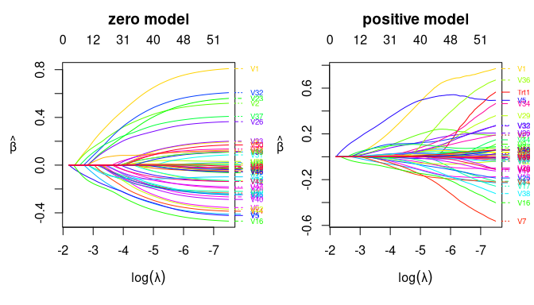

<!-- README.md is generated from README.Rmd. Please edit that file -->

# personalized2part

The `personalized2part` package allows for subgroup identification for
semi-continuous outcomes by estimating individualized treatment rules.
It uses a two part modeling (or hurdle modeling) framework to handle
semi-continuous data by modeling separately the positive part of the
outcome and an indicator of whether each outcome is positive, but still
results in a single treatment rule. High dimensional data is handled
with a cooperative lasso penalty, which encourages the coefficients in
the two models to have the same sign.

## Installation

You can install the development version from
[GitHub](https://github.com/jaredhuling/personalized2part) with:

``` r
# install.packages("devtools")
devtools::install_github("jaredhuling/personalized2part")
```

## Example

This is a basic example which shows you how to solve a common problem:

``` r
library(personalized2part)
```

Simulate semicontinuous data with a heterogeneous treatment effect:

``` r
set.seed(1)
dat <- sim_semicontinuous_data(n.obs = 300, n.vars = 50)

x   <- dat$x
y   <- dat$y
trt <- dat$trt
```

Use the built-in function `create.propensity.function` from the
[personalized](https://cran.r-project.org/web/packages/personalized/index.html)
package to construct a function that fits a propensity score model using
10-fold cross fitting:

``` r
propens_func <- create.propensity.function(crossfit = TRUE, 
                                           nfolds.crossfit = 10, 
                                           cv.glmnet.args = list(type.measure = "auc"))
```

Use the built-in function `create.propensity.function` from the
[personalized](https://cran.r-project.org/web/packages/personalized/index.html)
package to construct outcome augmentation functions for the zero part
model using 10-fold cross fitting:

``` r
aug_func_binary <- create.augmentation.function(family = "binomial",
                                                crossfit = TRUE, 
                                                nfolds.crossfit = 10, 
                                                cv.glmnet.args = list(type.measure = "auc"))
```

Use the built-in function `HDtweedie_kfold_aug` from the
personalized2part package to construct outcome augmentation functions
for the positive part model using 10-fold cross fitting using a
penalized gamma regression model:

``` r

aug_func_positive <- function(x, y, trt)
{
        HDtweedie_kfold_aug(x, y, trt, K = 10, p = 2,
                            interactions = TRUE)
}
```

``` r
fitted_2part_subgrp_model <- fit_subgroup_2part(x, y, trt, 
                                                propensity.func = propens_func,
                                                propensity.func.positive = propens_func, 
                                                augment.func.zero = aug_func_binary,
                                                augment.func.positive = aug_func_positive)

## the model print display takes the same form as fitted models from
## the personalized package
fitted_2part_subgrp_model
#> family:    2part 
#> loss:      2part 
#> method:    
#> cutpoint:  1 
#> propensity 
#> function:  propensity.func 
#> 
#> benefit score: f(x), 
#> Trt recom = 1*I(f(x)>c)+0*I(f(x)<=c) where c is 'cutpoint'
#> 
#> Average Outcomes:
#>               Recommended 0     Recommended 1
#> Received 0 20.1019 (n = 82)   0.5407 (n = 60)
#> Received 1  1.0492 (n = 51) 11.2566 (n = 107)
#> 
#> Treatment effects conditional on subgroups:
#> Est of E[Y|T=0,Recom=0]-E[Y|T=/=0,Recom=0] 
#>                          19.0527 (n = 133) 
#> Est of E[Y|T=1,Recom=1]-E[Y|T=/=1,Recom=1] 
#>                          10.7159 (n = 167) 
#> 
#> NOTE: The above average outcomes are biased estimates of
#>       the expected outcomes conditional on subgroups. 
#>       Use 'validate.subgroup()' to obtain unbiased estimates.
#> 
#> ---------------------------------------------------
#> 
#> Benefit score quantiles (f(X) for 1 vs 0): 
#>        0%       25%       50%       75%      100% 
#> 4.668e-03 3.223e-01 1.257e+00 4.588e+00 2.827e+02 
#> 
#> ---------------------------------------------------
#> 
#> Summary of individual treatment effects: 
#> E[Y|T=1, X] / E[Y|T=0, X]
#> 
#> Note: for survival outcomes, the above ratio is 
#> E[g(Y)|T=1, X] / E[g(Y)|T=0, X], 
#> where g() is a monotone increasing function of Y, 
#> the survival time
#> 
#>      Min.   1st Qu.    Median      Mean   3rd Qu.      Max. 
#>   0.00467   0.32230   1.25687   7.27565   4.58799 282.74366
```

We can plot the coefficient curves for the two models as the following:

``` r
par(mfrow = c(1,2))
plot(fitted_2part_subgrp_model$model$hd2part.fit, "zero")
plot(fitted_2part_subgrp_model$model$hd2part.fit, "positive")
```



Now evaluate value function on test set based on the estimated
individualized treatment rule and compare with average outcome (a value
function larger than the average outcome means that the ITR results in
better outcomes than standard practice). The predict function returns
predicted values for the heterogeneous treatment effect in terms of the
risk ratio \(E[Y|X,T=1] / E[Y|X,T=-1]\), so greater than 1 means the
treatment is beneficial (if larger outcomes are preferred).

``` r

dat.test <- sim_semicontinuous_data(n.obs = 10000, n.vars = 50)

x.test   <- dat.test$x
y.test   <- dat.test$y

predicted_hte <- predict(fitted_2part_subgrp_model, x.test)

## estmated test set value function:
personalized2part:::computeValue(y.test, predicted_hte, dat.test$trt,
                                 pi.x = dat.test$pi.x, cutoff = 1)
#> [1] 13.23841

## average outcome in the test set:
mean(dat.test$y)
#> [1] 8.43557

# We can see that the estimated treatment rule results in better outcomes for the test set
```

Now let’s compare with simply using a squared error loss under the
framework of Chen, et al (2017) to estimate an ITR:

``` r


fsm_log <- fit.subgroup(x, log(y+0.1), trt, propensity.func = propens_func, 
                    augment.func = create.augmentation.function(family="gaussian"),
                    loss = "sq_loss_lasso")

fsm <- fit.subgroup(x, y, trt, propensity.func = propens_func, 
                    augment.func = create.augmentation.function(family="gaussian"),
                    loss = "sq_loss_lasso")

pred_hte_sqloss_log <- predict(fsm_log, x.test)
pred_hte_sqloss <- predict(fsm, x.test)

## the value function is smaller than for the 2 part model
personalized2part:::computeValue(y.test, pred_hte_sqloss, dat.test$trt,
                                 pi.x = dat.test$pi.x, cutoff = 0)
#> [1] 7.476902

personalized2part:::computeValue(y.test, pred_hte_sqloss_log, dat.test$trt,
                                 pi.x = dat.test$pi.x, cutoff = 0)
#> [1] 11.218
```
